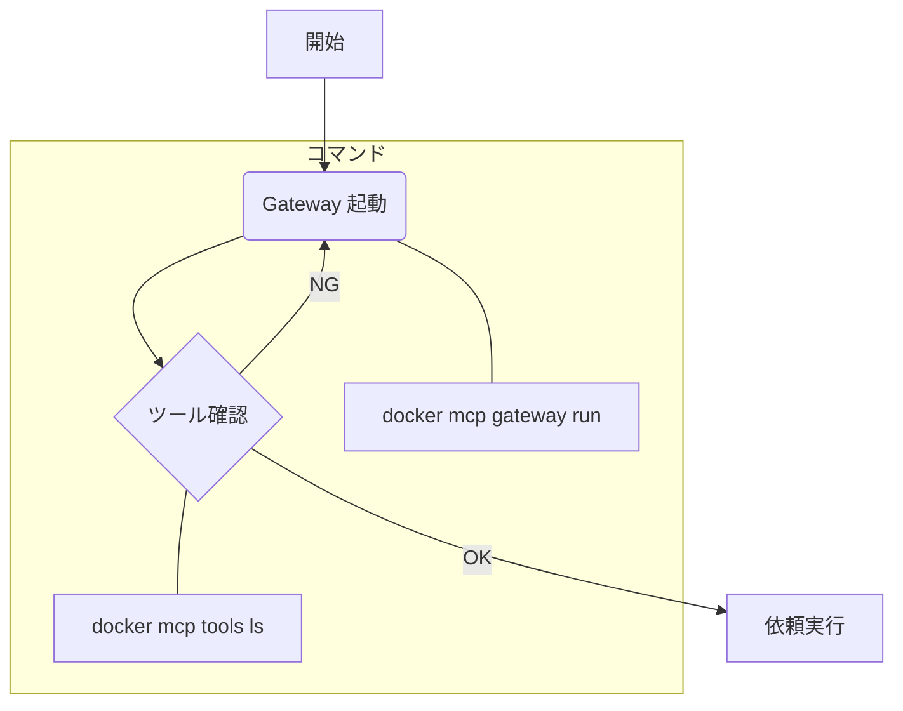

# Docker MCP Toolkit ワークフロー

## AI エージェントへの初期指示プロンプト（コピペ用）

AI エージェントとのセッション開始時に、以下のテキストをコピー＆ペーストして指示してください。

```text
MCP サーバーの利用には **Docker MCP Toolkit** を使用します。
以下の手順で環境を準備し、ツールを認識してください。

1. `docker mcp gateway run` を実行して Gateway を起動する。
2. `docker mcp tools ls` を実行して、利用可能なツールを確認・認識する。

上記が完了したら、ツールが使用可能な状態であることを報告してください。その後に具体的な依頼を行います。
```

MCP サーバーの管理・利用を Docker MCP Toolkit で行うための標準手順です。

## 手順概要

複雑な設定は避け、以下の 3 ステップで確実に実行します。

1. **起動**: Gateway を立ち上げる
2. **確認**: ツールが認識されているか確認する
3. **実行**: AI に依頼を投げる

## 詳細フロー



### 1. Gateway の起動

まず、MCP サーバーへの入り口となる Gateway を起動します。

```bash
docker mcp gateway run
```

### 2. ツールの確認

Gateway が立ち上がったら、利用可能なツールが正しく認識されているか確認します。
これを行うことで、AI が「ツールがない」と困るのを防ぎます。

```bash
docker mcp tools ls
```

### 3. 依頼の実行

ツールが表示されたら準備完了です。AI にやりたいことを依頼してください。
