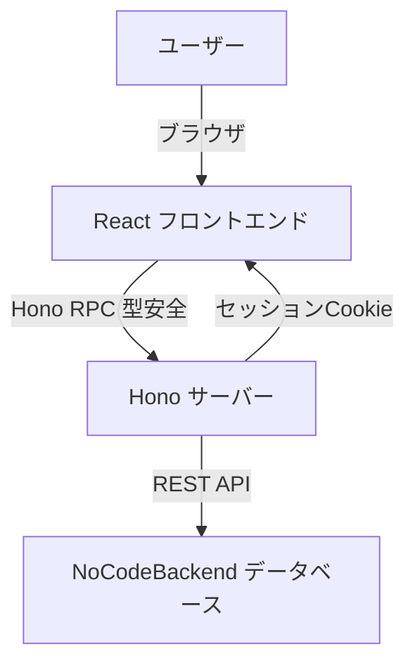

# Architect - 設計編

> このドキュメントは以下の内容を統合しています:
> 技術スタック選定、アーキテクチャ設計、開発フロー、ディレクトリ構成、環境構築手順、学習リソース

---

## 技術スタック選定

### なぜこの構成を選んだか

個人開発において、**「制御可能で、長期的にメンテナンスしやすい」** 構成を選びました。

### 採用技術一覧

| 技術                | 役割           | 選定理由                                             |
| ------------------- | -------------- | ---------------------------------------------------- |
| **Node.js**         | ランタイム     | どこでも動く標準技術                                 |
| **Hono (v4)**       | バックエンド   | Web 標準準拠で軽量、型安全                           |
| **React + Vite**    | フロントエンド | ビルドが速く、開発体験が良い                         |
| **TanStack Router** | ルーティング   | URL・クエリパラメータの完全な型安全性                |
| **TypeScript**      | 言語           | 型安全性でバグを減らす                               |
| **Hono RPC**        | 通信           | バックエンドとフロントエンドの型を共有               |
| **TanStack Query**  | 状態管理       | 非同期データの管理が簡単                             |
| **Tailwind CSS**    | スタイリング   | クラス名を書くだけなので AI がデザインを生成しやすい |
| **shadcn/ui**       | UI ライブラリ  | Tailwind ベースで AI が理解しやすい構造              |
| **Docker**          | デプロイ       | どこでも同じ環境で動く                               |

### BTO（自作 PC）の考え方

メーカー製 PC（Next.js 等のフルスタックフレームワーク）ではなく、**必要なパーツを自分で選ぶ BTO 構成**を採用しています。

#### 必須パーツ（これがないと動かない）

| PC パーツ      | 技術スタック       | 役割と理由                                       |
| -------------- | ------------------ | ------------------------------------------------ |
| **CPU**        | **Hono (Node.js)** | 演算処理装置。すべてのロジック、リクエスト処理。 |
| **Monitor**    | **React**          | 出力装置。ユーザーが見る画面を描画する。         |
| **Case / PSU** | **Docker**         | PC ケースと電源。どこでも動く環境を提供。        |
| **BIOS**       | **Vite**           | 起動システム。開発サーバーとビルドを担当。       |
| **配線**       | **TypeScript**     | データが正しく流れることを保証する型システム。   |

#### 拡張パーツ（あると爆速になる）

| PC パーツ          | 技術スタック       | 役割と理由                                     |
| ------------------ | ------------------ | ---------------------------------------------- |
| **High-Speed Bus** | **Hono RPC**       | 型安全な専用伝送路。データ転送ロスがゼロ。     |
| **RAM (Memory)**   | **TanStack Query** | キャッシュメモリ。一度取得したデータを保存。   |
| **Gaming GPU**     | **Tailwind CSS**   | グラフィック描画エンジン。画面をリッチに描画。 |
| **GPU ドライバ**   | **shadcn/ui**      | GPU の性能を引き出すコンポーネント群。         |

#### パーツ交換の例

| PC パーツ  | 交換シナリオ                                             |
| ---------- | -------------------------------------------------------- |
| **CPU**    | Hono → Express や Fastify に変更してもロジックは流用可能 |
| **GPU**    | React → SolidJS や Vue に載せ替え可能（Vite 対応）       |
| **ケース** | Cloud Run → AWS App Runner や VPS にコンテナごと引越し   |

### Next.js との比較

| 項目                   | Next.js (App Router)                      | 今回の構成 (Vite + Hono)                  |
| ---------------------- | ----------------------------------------- | ----------------------------------------- |
| **ブラックボックス度** | 高い（キャッシュ戦略、Server Actions 等） | **低い（標準的な React と HTTP のみ）**   |
| **依存度**             | ベンダーロックインが強い                  | **標準技術の組み合わせで剥がしやすい**    |
| **デバッグ**           | サーバー/クライアントの境界が曖昧         | **境界が明確（HTTP 通信）で切り分け容易** |
| **AI との相性**        | 独自概念が多く AI が混乱しやすい          | **Web 標準で AI の精度が高い**            |

#### Next.js を選ぶべきケース

- OGP 画像の自動生成や SEO が最重要
- SSR（サーバーサイドレンダリング）が必須
- Vercel のエコシステムをフル活用したい

### ランタイムの選択肢：Bun について

Node.js の代わりに **Bun** を使うことも可能です。

| 項目          | Node.js          | Bun                        |
| ------------- | ---------------- | -------------------------- |
| **速度**      | 標準的           | 爆速（起動・実行とも）     |
| **互換性**    | 高い（実績豊富） | 発展途上（一部非互換あり） |
| **Cloud Run** | 安定動作         | 対応可能だが実績少なめ     |
| **Hono 対応** | ◎                | ◎（ネイティブ対応）        |

**結論**: 安定性重視なら Node.js、ローカル開発の爆速感重視なら Bun。本番は Node.js が堅実。

### ロックイン回避

特定のベンダー（Vercel 等）に依存しない構成にしています。これにより：

- デプロイ先を自由に選べる（Cloud Run、AWS、VPS 等）
- 将来の変更に対応しやすい
- 技術的な負債が少ない

### ローカルアプリへの発展

この構成は **Electron** や **Tauri** への移行が容易です。

| 項目         | 移行難易度 | 理由                                          |
| ------------ | ---------- | --------------------------------------------- |
| **Electron** | 非常に低い | Node.js + Chromium なのでコードがそのまま動く |
| **Tauri**    | 低い       | Rust 製で軽量。Sidecar で Node.js を同梱可能  |

**Web アプリ → デスクトップアプリ** への派生が可能なため、最初から Electron で作る必要がありません。

---

## アーキテクチャ設計

### Hono Proxy パターン

フロントエンドはデータベースに直接接続せず、**必ず Hono を経由**します。



### なぜこの構成か

#### 1. セキュリティ

- **API キーの保護**: データベースの API キーをブラウザに露出させない
- **認証の一元管理**: Hono でセッション管理を行う

#### 2. 制約の吸収

データベースの制約（例：バルク処理ができない）を、Hono 側で吸収します。

**例**: 1000 件のデータを更新する場合

- ❌ フロントエンドから 1000 回 API を叩く → ブラウザが重い
- ✅ Hono 側で並列処理して、フロントエンドは 1 回のリクエストで済む

#### 3. 型安全性

バックエンドの型定義をフロントエンドでそのまま使えます。

### 各レイヤーの役割

#### React（フロントエンド）

- **UI の描画**: 画面を表示する
- **ユーザー入力の受け付け**: ボタンクリック、フォーム入力など
- **データの表示**: TanStack Query で取得したデータを表示

**やってはいけないこと**:

- データベースに直接接続
- 複雑なビジネスロジックを書く

#### Hono（バックエンド）

- **API の提供**: フロントエンドからのリクエストを受け取る
- **データベースとの通信**: NoCodeBackend に API リクエストを送る
- **ロジックの実装**: ビジネスロジックをここに書く
- **認証管理**: セッション Cookie の発行・検証

**やってはいけないこと**:

- UI の描画（それは React の仕事）

#### NoCodeBackend（データベース）

- **データの保存**: 永続化層として機能
- **認証機能の提供**: パスワードハッシュ化、リセットメール送信など

### ディレクトリ構造

```text
プロジェクト/
├── backend/          # Honoサーバー
│   └── src/
│       └── index.ts  # エントリーポイント
└── frontend/         # Reactアプリ
    └── src/
        └── lib/
            └── client.ts  # Hono RPCクライアント
```

### 重要な原則

1. **フロントエンドはデータベースを知らない**: Hono 経由でしかアクセスしない
2. **Hono は制御層**: 単なるプロキシではなく、アプリの「脳」として機能
3. **型は共有する**: バックエンドの型定義をフロントエンドで使う

### スケーリングへの備え

この構成は小〜中規模のアプリに最適です。成長に伴い、以下の点を検討します：

#### パフォーマンス

- **キャッシュ**: 頻繁にアクセスするデータは Hono 側でキャッシュ
- **ページネーション**: 大量データは分割して取得
- **CDN**: 静的ファイルは CDN で配信

#### モニタリング

- **ログ**: エラーや遅いリクエストを記録
- **メトリクス**: レスポンス時間やエラー率を監視

---

## 開発フロー

### Vibe Coding とは

**AI を活用して、フロー状態（集中状態）を維持しながら高速で開発する**スタイルです。

### 開発開始前の儀式

コードを書き始める前に、必ず以下の手順を実行します。

#### Step 1: ドキュメント読み込み

AI（Cursor 等）に、このドキュメント群を読み込ませます。

```text
「docs/vibe_coding/ 配下のドキュメントを読み込んでください。
この構成に基づいて開発を進めます。」
```

#### Step 2: 壁打ち（要件整理）

コードを書く前に、AI と対話して要件を整理します。

**やること**:

- 作りたい機能を説明する
- AI と対話して曖昧な点を明確にする
- 実装計画を立てる

**やってはいけないこと**:

- いきなり `npm install` を始める
- コードを書き始める

#### Step 3: 実装

壁打ちで計画が固まったら、実装に進みます。

AI にコードを生成させる際は、以下の原則を思い出させます：

- KISS 原則（シンプルに）
- Hono RPC の型定義を活用
- 過剰な抽象化を避ける

### 開発中の心構え

#### フロー状態を維持する

- **中断を避ける**: 一度集中したら、できるだけ続ける
- **小さく始める**: 完璧を目指さず、まず動くものを作る
- **エラーに動揺しない**: AI に聞けば解決できる

#### AI との対話のコツ

- **具体的に**: 「いい感じに」ではなく「ユーザー一覧を表示して」と指示
- **文脈を共有**: エラーが出たら、エラーメッセージ全体を貼り付ける
- **段階的に**: 一度に全部作ろうとせず、小さく分けて実装

### よくある質問

#### Q: エラーが出た時は？

A: エラーメッセージを AI に貼り付けて、解決方法を聞きましょう。多くの場合、すぐに解決できます。

#### Q: 実装方針が分からない時は？

A: 壁打ちに戻りましょう。要件を整理すれば、方針が見えてきます。

#### Q: コードの品質は？

A: まず動くものを作りましょう。動いてから、必要に応じて改善します。

### チェックリスト

開発を始める前に：

- [ ] ドキュメントを AI に読み込ませた
- [ ] 壁打ちで要件を整理した
- [ ] 実装計画が立った
- [ ] 開発環境が整った

開発中：

- [ ] 小さく始めて、動くものを作った
- [ ] エラーが出たら、AI に相談した
- [ ] 型エラーが出たら、Hono RPC の設定を確認した
- [ ] アンチパターンを避けている

---

## ディレクトリ構成

### 標準構成

```text
プロジェクト/
├── package.json          # ルート：全体のスクリプト管理
├── Dockerfile           # デプロイ用
├── tsconfig.json        # TypeScript設定
├── vibe-app.code-workspace  # VS Code設定
│
├── backend/             # Honoサーバー
│   ├── src/
│   │   ├── index.ts     # エントリーポイント（AppTypeをエクスポート）
│   │   └── routes/     # APIルート定義
│   └── package.json
│
└── frontend/            # Reactアプリ
    ├── src/
    │   ├── lib/
    │   │   └── client.ts  # Hono RPCクライアント
    │   ├── routes/        # TanStack Router ルート定義
    │   │   ├── __root.tsx # ルートレイアウト
    │   │   ├── index.tsx  # / ページ
    │   │   └── books.tsx  # /books ページ
    │   ├── components/    # Reactコンポーネント
    │   ├── routeTree.gen.ts # 自動生成（編集しない）
    │   └── main.tsx       # エントリーポイント
    ├── vite.config.ts
    └── package.json
```

### 各ディレクトリの役割

#### backend/

バックエンドのロジックを置きます。

- **index.ts**: サーバーの起動と、型定義のエクスポート
- **routes/**: API エンドポイントの定義

#### frontend/

フロントエンドの UI を置きます。

- **lib/client.ts**: Hono RPC クライアントの設定
- **routes/**: TanStack Router のルート定義（ファイルベースルーティング）
- **components/**: React コンポーネント
- **routeTree.gen.ts**: TanStack Router が自動生成（手動編集しない）
- **main.tsx**: アプリのエントリーポイント（Router と Query の Provider 設定）

### VS Code ワークスペース設定

`.code-workspace` ファイルを使うと、エディタで見やすく表示できます。

#### 設定例

```json
{
  "folders": [
    {
      "path": "backend",
      "name": "🟢 Backend (Hono API)"
    },
    {
      "path": "frontend",
      "name": "🔵 Frontend (React UI)"
    },
    {
      "path": ".",
      "name": "📦 Root (Docker / Configs)"
    }
  ]
}
```

#### 使い方

1. VS Code で「ファイル」→「ワークスペースを開く」
2. `.code-workspace` ファイルを選択
3. サイドバーに 3 つのセクションが表示される

### 起動コマンド

#### ルートの package.json

```json
{
  "scripts": {
    "dev": "concurrently \"npm run dev:backend\" \"npm run dev:frontend\"",
    "dev:backend": "npm run dev --workspace=backend",
    "dev:frontend": "npm run dev --workspace=frontend"
  }
}
```

#### 実行

```bash
npm run dev
```

これで、バックエンドとフロントエンドが同時に起動します。

### 重要な原則

1. **役割を分離**: バックエンドとフロントエンドは明確に分ける
2. **型は共有**: バックエンドの型をフロントエンドで使う
3. **設定はルートに**: 共通の設定ファイルはルートに置く

### よくある質問

#### Q: 共通の型定義はどこに置く？

A: バックエンドの `index.ts` からエクスポートして、フロントエンドでインポートします。

#### Q: 設定ファイルが増えた

A: ルートに集約しましょう。各ディレクトリには必要最小限の設定だけを置きます。

#### Q: ディレクトリが深すぎる

A: シンプルに保ちましょう。必要以上に階層を作らないようにします。

---

## 環境構築手順

### セットアップの流れ

新しいプロジェクトを始める際の、具体的な手順です。

### Step 1: プロジェクトの初期化

#### ディレクトリ作成

```bash
mkdir my-vibe-app
cd my-vibe-app
```

#### ルートの package.json 作成

```bash
npm init -y
```

#### 必要なパッケージをインストール

```bash
# 開発用ツール
npm install -D concurrently

# workspaces設定（オプション）
npm install -D -w backend -w frontend
```

### Step 2: バックエンドのセットアップ

#### ディレクトリ作成

```bash
mkdir backend
cd backend
npm init -y
```

#### Hono と TypeScript をインストール

```bash
npm install hono
npm install -D typescript @types/node tsx
```

#### tsconfig.json 作成

```json
{
  "compilerOptions": {
    "target": "ES2022",
    "module": "ESNext",
    "lib": ["ES2022"],
    "moduleResolution": "bundler",
    "strict": true,
    "esModuleInterop": true,
    "skipLibCheck": true,
    "outDir": "./dist"
  },
  "include": ["src/**/*"]
}
```

#### package.json の scripts 設定

```json
{
  "scripts": {
    "dev": "tsx watch src/index.ts",
    "build": "tsc",
    "start": "node dist/index.js"
  }
}
```

### Step 3: フロントエンドのセットアップ

#### ディレクトリ作成

```bash
cd ..
mkdir frontend
cd frontend
npm create vite@latest . -- --template react-ts
```

#### 必要なパッケージをインストール

```bash
npm install
npm install @tanstack/react-query @tanstack/react-router hono zod
npm install -D tailwindcss postcss autoprefixer @tanstack/router-plugin @tanstack/router-devtools
```

#### Tailwind CSS のセットアップ

```bash
npx tailwindcss init -p
```

これで `tailwind.config.js` と `postcss.config.js` が作成されます。

#### tailwind.config.js の設定

```javascript
/** @type {import('tailwindcss').Config} */
export default {
  content: ["./index.html", "./src/**/*.{js,ts,jsx,tsx}"],
  theme: {
    extend: {},
  },
  plugins: [],
};
```

#### CSS ファイルの設定

`frontend/src/index.css` または `frontend/src/App.css` に以下を追加：

```css
@tailwind base;
@tailwind components;
@tailwind utilities;
```

#### main.tsx で CSS をインポート

```typescript
import "./index.css"; // または App.css
```

#### vite.config.ts の設定

```typescript
import { defineConfig } from "vite";
import react from "@vitejs/plugin-react";
import { TanStackRouterVite } from "@tanstack/router-plugin/vite";

export default defineConfig({
  plugins: [TanStackRouterVite(), react()],
  server: {
    proxy: {
      "/api": {
        target: "http://localhost:3000",
        changeOrigin: true,
      },
    },
  },
});
```

### Step 4: ルートの設定ファイル

#### package.json（ルート）

```json
{
  "name": "my-vibe-app",
  "private": true,
  "scripts": {
    "dev": "concurrently \"npm run dev --workspace=backend\" \"npm run dev --workspace=frontend\"",
    "build": "npm run build --workspaces",
    "start": "npm run start --workspace=backend"
  },
  "workspaces": ["backend", "frontend"],
  "devDependencies": {
    "concurrently": "^9.0.0"
  }
}
```

#### .gitignore

```gitignore
node_modules/
dist/
.env
.env.local
*.log
.DS_Store
```

### Step 5: 基本ファイルの作成

#### backend/src/index.ts

```typescript
import { Hono } from "hono";
import { cors } from "hono/cors";

const app = new Hono();

app.use("*", cors());

const routes = app.get("/api/hello", (c) => {
  return c.json({ message: "Hello from Hono!" });
});

export default app;
export type AppType = typeof routes;
```

#### frontend/src/lib/client.ts

```typescript
import { hc } from "hono/client";
import type { AppType } from "../../../backend/src/index";

const API_URL = import.meta.env.PROD
  ? window.location.origin
  : "http://localhost:3000";

export const client = hc<AppType>(API_URL);
```

#### frontend/src/routes/\_\_root.tsx（ルートレイアウト）

```typescript
import { createRootRoute, Outlet } from "@tanstack/react-router";
import { TanStackRouterDevtools } from "@tanstack/router-devtools";

export const Route = createRootRoute({
  component: () => (
    <>
      <Outlet />
      <TanStackRouterDevtools />
    </>
  ),
});
```

#### frontend/src/routes/index.tsx（ホームページ）

```typescript
import { createFileRoute } from "@tanstack/react-router";
import { useQuery } from "@tanstack/react-query";
import { client } from "../lib/client";

export const Route = createFileRoute("/")({
  component: HomePage,
});

function HomePage() {
  const { data, isLoading } = useQuery({
    queryKey: ["hello"],
    queryFn: async () => {
      const res = await client.api.hello.$get();
      if (!res.ok) throw new Error("Failed");
      return res.json();
    },
  });

  if (isLoading) return <div className="p-4">Loading...</div>;

  return (
    <div className="p-4">
      <h1 className="text-2xl font-bold">{data?.message}</h1>
    </div>
  );
}
```

#### frontend/src/main.tsx（エントリーポイント）

```typescript
import React from "react";
import ReactDOM from "react-dom/client";
import { RouterProvider, createRouter } from "@tanstack/react-router";
import { QueryClient, QueryClientProvider } from "@tanstack/react-query";
import { routeTree } from "./routeTree.gen"; // 自動生成される
import "./index.css";

const queryClient = new QueryClient();
const router = createRouter({ routeTree });

// 型安全性のための宣言
declare module "@tanstack/react-router" {
  interface Register {
    router: typeof router;
  }
}

ReactDOM.createRoot(document.getElementById("root")!).render(
  <React.StrictMode>
    <QueryClientProvider client={queryClient}>
      <RouterProvider router={router} />
    </QueryClientProvider>
  </React.StrictMode>
);
```

### Step 6: 動作確認

#### 起動

```bash
npm run dev
```

#### 確認

- バックエンド: <http://localhost:3000/api/hello>
- フロントエンド: <http://localhost:5173>

### よくある問題

#### Q: ポートが既に使われている

A: 別のポートを使うか、使用中のプロセスを終了します。

#### Q: 型エラーが出る

A: `backend/src/index.ts` で `AppType` をエクスポートしているか確認します。

#### Q: CORS エラーが出る

A: バックエンドで `cors()` ミドルウェアを設定します。

---

## 学習リソース

### 学習の目的

AI（LLM）に対して的確な指示を出し、生成されたコードの良し悪しを判断するための知識を身につけます。

### 必修科目

#### HTTP と Web 標準（Hono 理解の基礎）

Hono は Web 標準に準拠しているので、HTTP の理解がそのまま Hono の習熟に直結します。

##### 書籍

- **『Web を支える技術』（山本陽平 著）**

  - HTTP リクエスト/レスポンス、ステータスコード、REST の概念を学ぶ
  - AI に「RESTful な設計にして」と指示する際の解像度を高める

- **『Real World HTTP』（渋川よしき 著）**
  - 現代のブラウザ挙動、CORS、HTTP/2 など
  - トラブルシューティングに役立つ

##### 人物

- **Yusuke Wada (@yusukebe)**: Hono の作者
  - ブログや SNS を追い、フレームワークの思想（Web Standard First）を理解

#### TypeScript の型システム

型パズルに時間を溶かさず、End-to-End の型安全性を享受するために。

##### 書籍

- **『プログラミング TypeScript』（オライリー）**

  - 特に「ジェネリクス」の章が重要
  - `hc<AppType>` のような型の流れを理解

- **『Effective TypeScript』**
  - `any` を避ける技術、型定義と実装の分離
  - 品質の高いコードを見極める眼を養う

#### React と状態管理（TanStack Query）

`useEffect` 地獄から脱却し、宣言的なデータフェッチをマスター。

##### 動画

- **Jack Herrington（YouTube）**
  - React Query、Next.js vs Vite などの比較解説
  - 「なぜ `useEffect` で fetch してはいけないのか」を理解

##### 概念

- **State Colocation（Kent C. Dodds）**
  - 「状態は使う場所の近くに置く」という原則
  - AI にコンポーネント設計を指示する際の指針

#### TanStack Router（型安全なルーティング）

URL とクエリパラメータの型安全性を確保するためのルーター。

##### 公式ドキュメント

- **TanStack Router Docs**
  - <https://tanstack.com/router/latest>
  - 特に「Search Params」セクションが重要（NCB との連携に直結）

##### 動画

- **Theo - t3.gg（YouTube）**

  - TanStack Router vs React Router の比較
  - 型安全なルーティングの重要性

- **TanStack Start vs Next.js**
  - <https://www.youtube.com/watch?v=SrOgvTSbNJ0>
  - Next.js からの移行手順と、標準的な Web 技術への回帰

##### 人物

- **Tanner Linsley (@tanaborern)**
  - TanStack（Query, Router, Table 等）の作者
  - TanStack Query で実績があり、Router も信頼できる

#### テスト戦略（Playwright）

テストコードを書かずに品質を担保する手法。

##### ツール

- **Playwright Codegen**
  - 公式ドキュメントの「Codegen」セクションを読む
  - 録画 → コード生成のフローを身体で覚える

### 特化科目（NoCodeBackend）

#### 公式ドキュメント

- **NoCodeBackend Official Docs**
  - **Swagger JSON Export** 機能が最重要
  - `openapi-typescript` に食わせて型生成するフロー

#### 動画

- **公式 YouTube チャンネル**
  - AI Builder のプロンプト例を参考
  - 自然言語でのスキーマ操作術を学ぶ

### 教養科目

#### トレンドとマインドセット

「BTO 構成」の妥当性を再確認し、エンジニアリングの視野を広げる。

##### 動画

- **Theo - t3.gg（YouTube）**
  - 「Next.js へのロックインを避けろ」「Vite を使え」といった発信
  - Vibe Coding の精神的支柱

##### 雑誌

- **『Software Design』（技術評論社）**
  - Docker 特集や React 特集など
  - 特定トピックを広く浅くキャッチアップ

### 学習アクションプラン

#### Phase 1: セットアップ

1. 『Web を支える技術』を流し読み
2. Hono の Hello World を動かす

#### Phase 2: データ取得

1. Jack Herrington の動画を見る
2. TanStack Query の概念を掴む
3. NCB と接続する

#### Phase 3: 型システム

1. 『プログラミング TypeScript』のジェネリクスを読む
2. `ncb-schema.ts` の型定義がどう流れているか理解

#### Phase 4: テスト

1. Playwright Codegen で操作を録画
2. テストの楽さを体感

### 学習のコツ

1. **完璧を目指さない**: 必要な部分だけ学ぶ
2. **実践しながら**: 本を読むだけでなく、コードを書く
3. **AI と対話**: 分からないことは AI に聞く
4. **コミュニティをフォロー**: 最新情報をキャッチアップ

### よくある質問

#### Q: 全部読む必要がある？

A: いいえ。必要な部分だけ読めば十分です。まずは Phase 1 から始めましょう。

#### Q: 英語の資料が苦手

A: 日本語の資料から始めましょう。慣れてきたら英語の資料も読めます。

#### Q: 時間がない

A: 動画や短い記事から始めましょう。完璧を目指さず、少しずつ学びます。
