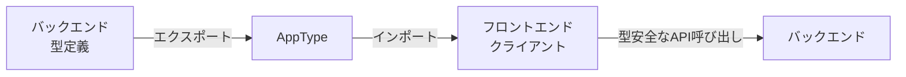

# Code - 実装編

> このドキュメントは以下の内容を統合しています:
> データベース戦略、型安全性の実現、通信と状態管理の選定、WebhookとAPI、テスト戦略、Tailwind CSSの使い方、VS Code ワークスペース設定、アンチパターンとベストプラクティス

---

## データベース戦略

### NoCodeBackend (NCB) の採用理由

#### なぜ選んだか

1. **コスト**: LTD（買い切り）プランで、ランニングコストが低い
2. **管理不要**: サーバー管理やセキュリティパッチが不要
3. **開発速度**: GUI や AI でスキーマを簡単に作れる

#### 注意点

- **依存リスク**: NCB サービスが終了する可能性はある
- **移行準備**: Swagger JSON をエクスポートできるので、移行は可能

### Hono 経由でのアクセス

フロントエンドからは**直接 NCB に接続せず、必ず Hono を経由**します。


#### 理由

1. **セキュリティ**: API キーをブラウザに露出させない
2. **制約の吸収**: NCB の制約を Hono 側で処理
3. **型安全性**: Hono RPC で型を共有

### 型生成ワークフロー

NCB のスキーマ変更時は、以下の手順で型を更新します。

#### 手順

1. **NCB でスキーマ変更**: GUI や AI Builder でテーブルを変更
2. **Swagger JSON をエクスポート**: NCB の管理画面からエクスポート
3. **型定義を生成**: `openapi-typescript` で TypeScript 型を作成

```bash
npx openapi-typescript ./swagger.json -o ./backend/src/types/ncb-schema.ts
```

4. **型エラーを確認**: Hono のコードで型エラーが出たら、修正箇所が分かる

### 認証の実装

#### パスワード管理

NCB の `Password` 型を使うと、自動でハッシュ化されます。

- **Hono の役割**: 平文のパスワードを NCB に送るだけ
- **NCB の役割**: ハッシュ化して保存

#### パスワードリセット

NCB のネイティブ機能を使います。

- **Hono の役割**: NCB のリセット API を呼ぶだけ
- **NCB の役割**: メール送信とトークン管理

#### セッション管理

NCB にはセッション機能がないので、Hono で実装します。

1. ユーザーがログイン
2. Hono が NCB でパスワード検証
3. 検証 OK なら、Hono が Cookie を発行
4. 以降のリクエストで Cookie を確認

### よくある制約と対処法

| NCB の制約         | Hono での対処法                         |
| ------------------ | --------------------------------------- |
| バルク処理がない   | `Promise.all` で並列リクエスト          |
| BLOB 非対応        | S3/R2 にアップロードし、URL だけ保存    |
| 複雑な検索が難しい | Hono 側でデータを取得してフィルタリング |

### ベストプラクティス

1. **API キーは環境変数に**: `.env` ファイルで管理
2. **型は自動生成**: Swagger JSON から型を作る
3. **エラーハンドリング**: NCB のエラーを適切に処理
4. **キャッシュ**: 頻繁にアクセスするデータは Hono 側でキャッシュ
5. **ページネーション**: 大量データは分割して取得

---

## 型安全性の実現

### なぜ型安全性が重要か

型があると、**コンパイル時にエラーを見つけられます**。実行してから「あ、エラーだった」ということが減ります。

### Hono RPC による型共有

バックエンドの型定義を、フロントエンドでそのまま使えます。

#### 仕組み



### 実装手順

#### Step 1: バックエンドで型をエクスポート

```typescript
// backend/src/index.ts
import { Hono } from "hono";

const app = new Hono();

const routes = app.get("/api/hello", (c) => {
  return c.json({ message: "Hello" });
});

// ★ ここが重要：型をエクスポート
export type AppType = typeof routes;
```

#### Step 2: フロントエンドで型をインポート

```typescript
// frontend/src/lib/client.ts
import { hc } from "hono/client";
import type { AppType } from "../../../backend/src/index";

// 型安全なクライアントを作成
export const client = hc<AppType>("http://localhost:3000");
```

#### Step 3: フロントエンドで使う

```typescript
// frontend/src/App.tsx
import { client } from "./lib/client";

// 型補完が効く！
const res = await client.api.hello.$get();
const data = await res.json(); // data.message が型安全
```

### メリット

#### 1. 自動補完が効く

エディタが「この API には何があるか」を教えてくれます。

#### 2. タイポを防げる

`client.api.helo.$get()` と書くと、エラーが出ます。

#### 3. 変更に強い

バックエンドの API を変更すると、フロントエンドで型エラーが出ます。これで「変更し忘れ」を防げます。

### NoCodeBackend の型生成

NCB を使う場合も、型を自動生成できます。

#### 手順

1. NCB から Swagger JSON をエクスポート
2. `openapi-typescript` で型を生成

```bash
npx openapi-typescript ./swagger.json -o ./backend/src/types/ncb-schema.ts
```

3. Hono のコードで型を使う

```typescript
import type { paths } from "./types/ncb-schema";

// NCBのAPIの型が使える
type UserResponse =
  paths["/users"]["get"]["responses"]["200"]["content"]["application/json"];
```

### よくある質問

#### Q: 型定義が複雑すぎる

A: 最初はシンプルに始めましょう。必要に応じて、型を分割して管理します。

#### Q: 型エラーが出た

A: バックエンドの API 定義を確認しましょう。多くの場合、型定義のミスです。

#### Q: 型がないライブラリを使いたい

A: `@types/ライブラリ名` をインストールするか、自分で型定義を書きます。

### TanStack Router による URL の型安全性

Hono RPC で API 通信の型安全性を確保したら、次は **URL（ルーティング）の型安全性** です。

#### なぜ URL の型安全性が必要か

NoCodeBackend (NCB) はクエリパラメータでフィルタリングを行います：

```text
/books?price_gt=1000&author=tanaka
```

React Router では、これらのパラメータに型がありません：

```typescript
// ❌ React Router: 型安全性なし
const [searchParams] = useSearchParams();
const price = searchParams.get("price_gt"); // string | null
const priceNum = price ? Number(price) : undefined; // 手動変換が必要
```

TanStack Router では、完全な型安全性が得られます：

```typescript
// ✅ TanStack Router: 完全な型安全性
const { price_gt, author } = Route.useSearch();
// price_gt は number | undefined（定義通り）
// author は string | undefined（定義通り）
```

#### 実装手順

##### Step 1: ルート定義で検索パラメータの型を定義

```typescript
// frontend/src/routes/books.tsx
import { createFileRoute } from "@tanstack/react-router";
import { z } from "zod";

const bookSearchSchema = z.object({
  price_gt: z.number().optional(),
  price_lt: z.number().optional(),
  author: z.string().optional(),
});

export const Route = createFileRoute("/books")({
  validateSearch: bookSearchSchema,
  component: BooksPage,
});
```

##### Step 2: コンポーネントで型安全に使用

```typescript
function BooksPage() {
  const { price_gt, author } = Route.useSearch();
  // price_gt は number | undefined（Zod スキーマ通り）

  const { data } = useQuery({
    queryKey: ["books", { price_gt, author }],
    queryFn: () => fetchBooks({ price_gt, author }),
  });

  return <BookList books={data} />;
}
```

##### Step 3: 型安全なナビゲーション

```typescript
import { useNavigate } from "@tanstack/react-router";

function FilterForm() {
  const navigate = useNavigate();

  const handleFilter = (price: number) => {
    navigate({
      to: "/books",
      search: { price_gt: price }, // 型チェックが効く
    });
  };

  return <button onClick={() => handleFilter(1000)}>1000円以上</button>;
}
```

### End-to-End 型安全性の完成

TanStack Router を導入することで、**End-to-End で型安全な構成**が完成します：


| 層               | 技術            | 型安全性 |
| ---------------- | --------------- | -------- |
| URL/ルーティング | TanStack Router | ✅ 完全  |
| API 通信         | Hono RPC        | ✅ 完全  |
| データ管理       | TanStack Query  | ✅ 完全  |
| データベース     | NCB 型生成      | ✅ 完全  |

### ベストプラクティス

1. **型は共有する**: バックエンドとフロントエンドで型を共有
2. **any は避ける**: 型が分からない時は、`unknown` を使う
3. **型定義ファイルを分ける**: 大きな型定義は別ファイルに
4. **自動生成を活用**: Swagger JSON から型を生成する
5. **URL も型安全に**: TanStack Router で検索パラメータに型を付ける

---

## 通信と状態管理の選定

### Hono RPC と TanStack Query の役割

この 2 つは「通信」と「データ管理」という異なる役割を担っています。

### 1. 通信担当：Hono RPC (hc)

**役割**: フロントエンドからバックエンドに「データください」とお願いする係。

#### 競合との比較

| 手法             | ツール例           | 特徴 (PC での例え)                                   | Vibe Coding 的評価 |
| ---------------- | ------------------ | ---------------------------------------------------- | ------------------ |
| **生(Raw)**      | `fetch`, `axios`   | 手書きの手紙。URL を間違えると届かない。型も不明。   | ❌ NG              |
| **規格ガチガチ** | GraphQL, OpenAPI   | 役所の申請書類。厳格だが書類作成が面倒。             | 🔺 微妙            |
| **型安全 RPC**   | **Hono RPC**, tRPC | 専用直通電話。相手が誰か（型）も完全に分かっている。 | ⭕️ 最強           |

#### なぜ Hono RPC が優れているか

- **tRPC** は Next.js など特定の構成に依存しがち
- **Hono RPC** は Hono でバックエンドを書くだけで**自動的に**型が共有される
- API 定義書を書く必要が一切ない

```typescript
// フロントエンドから呼ぶだけで型補完が効く
const res = await client.api.users.$get();
const data = await res.json(); // data の型が自動で分かる
```

### 2. データ管理担当：TanStack Query

**役割**: 受け取ったデータを「賢く管理」する係。ローディング、エラー、キャッシュを世話します。

#### 競合との比較

| 手法           | ツール例                 | 特徴 (PC での例え)                                 | Vibe Coding 的評価 |
| -------------- | ------------------------ | -------------------------------------------------- | ------------------ |
| **手動管理**   | `useEffect` + `useState` | 自分でメモ帳に記録。if 文だらけでスパゲッティ。    | ❌ NG              |
| **グローバル** | Redux, Zustand           | 巨大な倉庫。通信の状態管理には大掛かりすぎる。     | 🔺 微妙            |
| **非同期専用** | **TanStack Query**, SWR  | 敏腕秘書。キャッシュも再検証も勝手にやってくれる。 | ⭕️ 最強           |

#### なぜ TanStack Query が優れているか

- **SWR** も優秀だが、TanStack Query は機能が豊富で DevTools が強力
- 「画面を表示した瞬間にデータを裏で更新」「再接続時にリトライ」などを自動で行う

```typescript
// 宣言的にデータを取得
const { data, isLoading, error } = useQuery({
  queryKey: ["users"],
  queryFn: async () => {
    const res = await client.api.users.$get();
    return res.json();
  },
});
```

### 3. この 2 つを組み合わせると何が起きるか

#### 従来の開発（fetch + useEffect）

```typescript
// ❌ 悪い例：手動管理
const [data, setData] = useState(null);
const [loading, setLoading] = useState(true);
const [error, setError] = useState(null);

useEffect(() => {
  fetch("/api/users")
    .then((res) => res.json())
    .then((data) => {
      setData(data);
      setLoading(false);
    })
    .catch((err) => {
      setError(err);
      setLoading(false);
    });
}, []);
```

#### 今回の構成（Hono RPC + TanStack Query）

```typescript
// ✅ 良い例：宣言的
const { data, isLoading, error } = useQuery({
  queryKey: ["users"],
  queryFn: async () => {
    const res = await client.api.users.$get();
    if (!res.ok) throw new Error("Failed");
    return res.json();
  },
});
```

**違い:**

- コード量が 1/3 以下
- キャッシュ、再検証、リトライが自動
- 型安全（`data` の型が自動で分かる）

### 4. 制約の吸収パターン

#### 例：バルク API がない場合

DB にバルクインサート API がない場合でも、Hono 側で制御できます。

```typescript
// フロントエンド：1回のリクエストで済む
mutation.mutate(largeUserList);

// バックエンド（Hono）：並列で処理
app.post("/api/users/bulk", async (c) => {
  const users = await c.req.json();
  // Node.js のパワーで並列リクエスト
  await Promise.all(users.map((user) => db.insert(user)));
  return c.json({ success: true });
});
```

**ポイント**: ロジックを書き換えるのではなく、Hono 側で制御が効くため、フロントエンド側への変更は最小限で済みます。

### 5. 結論

「人間（と AI）が、面倒な通信制御と状態管理を一切考えずに、『ロジック』と『見た目』だけに集中できる構成」

一度この楽さを知ってしまうと、`fetch` と `useEffect` を手書きする時代には戻れません。

---

## Webhook と API の使い分け

### 基本方針

**基本はすべて API（同期処理）で実装**します。Webhook は特定のケースでのみ使います。

### API vs Webhook

| 項目           | API                    | Webhook                  |
| -------------- | ---------------------- | ------------------------ |
| **タイミング** | ユーザーが操作した瞬間 | データが変わった後       |
| **用途**       | データの表示、保存     | 通知、ログ記録、外部連携 |
| **待機時間**   | ユーザーを待たせる     | ユーザーを待たせない     |
| **実装**       | Hono から NCB を呼ぶ   | NCB から Hono を呼ぶ     |

### API を使う場面（基本）

#### ユーザー操作に基づく処理

- データの表示（一覧、詳細）
- データの保存（作成、更新、削除）
- ログイン、ログアウト

**例**: ユーザーが「保存」ボタンを押した時

```typescript
// フロントエンド
const mutation = useMutation({
  mutationFn: async (data) => {
    const res = await client.api.posts.$post({ json: data });
    return res.json();
  },
});
```

### Webhook を使う場面（例外）

#### 1. 管理画面での直接変更

NCB の管理画面で直接データを変更した時、Hono に通知します。

**例**: 管理画面でユーザーのプランを変更した時

```typescript
// Hono側でWebhookを受け取る
app.post("/webhooks/user-updated", async (c) => {
  const data = await c.req.json();
  // キャッシュをクリアするなど
  return c.json({ ok: true });
});
```

#### 2. 重い処理の非同期化

ユーザーを待たせたくない処理を、裏で実行します。

**例**: メール送信、外部サービス連携

```typescript
// Hono側でWebhookを受け取る
app.post("/webhooks/send-email", async (c) => {
  const data = await c.req.json();
  // メール送信処理（時間がかかる）
  await sendEmail(data);
  return c.json({ ok: true });
});
```

#### 3. 複数の副作用

データ変更をトリガーに、複数の処理を実行します。

**例**: ユーザー削除時に、ログ記録と統計更新を同時に行う

### Hono を Webhook の受け皿にする

Cloud Functions 等を用意せず、**Hono 自身に Webhook エンドポイントを実装**します。

#### メリット

- **ロジックが集約**: すべての処理が Hono 内にある
- **メンテナンスが簡単**: 1 つの場所で管理できる
- **型安全性**: Hono RPC と同じ型システムが使える

#### 実装例

```typescript
// backend/src/routes/webhooks.ts
app.post("/webhooks/ncb/*", async (c) => {
  // Webhookの検証（必要に応じて）
  const data = await c.req.json();

  // 処理を実行
  await handleWebhook(data);

  return c.json({ ok: true });
});
```

### 認証の実装

#### API 経由の認証

ユーザーがログインする時は、API を使います。

1. フロントエンドから ID/Pass を送る
2. Hono が NCB でパスワード検証
3. 検証 OK なら、Hono が Cookie を発行
4. 以降のリクエストで Cookie を確認

#### パスワードリセット

NCB のネイティブ機能を使います。

- Hono は NCB のリセット API を呼ぶだけ
- NCB がメール送信とトークン管理を行う

### 判断基準

#### API を使うべき時

- ✅ ユーザーが操作した時
- ✅ 即座に結果が必要な時
- ✅ データの表示や保存

#### Webhook を使うべき時

- ✅ 管理画面で直接変更した時
- ✅ ユーザーを待たせたくない重い処理
- ✅ データ変更をトリガーに複数の処理を実行

### ベストプラクティス

1. **最初は全部 API**: Webhook は必要になったら追加
2. **Hono で受け取る**: 別のサービスを作らない
3. **エラーハンドリング**: Webhook が失敗しても、アプリが止まらないようにする

---

## テスト戦略

### 基本方針

**テストコードを「書く」のではなく、「操作を録画する」**アプローチを採用します。

### Playwright Codegen の活用

#### なぜ選んだか

1. **簡単**: 操作するだけでテストコードができる
2. **正確**: 実際の操作を記録するので、意図が明確
3. **メンテナンスしやすい**: コードがシンプル

#### 従来のテストとの違い

| 従来のテスト       | Playwright Codegen       |
| ------------------ | ------------------------ |
| コードを書く       | 操作を録画する           |
| セレクタを考える   | 自動で賢いセレクタを選ぶ |
| メンテナンスが大変 | メンテナンスが簡単       |

### 使い方

#### Step 1: 録画を開始

```bash
npx playwright codegen http://localhost:3000
```

2 つのウィンドウが開きます：

- **左側**: あなたのアプリ（操作する場所）
- **右側**: 生成されるコード（見るだけ）

#### Step 2: 操作する

いつも通りアプリを操作します。

例：

1. ファイル一覧から `old_report.txt` を選ぶ
2. 新しい名前 `new_report_2024.txt` を入力
3. 「リネーム実行」ボタンを押す
4. 「成功しました」が表示されるのを確認

#### Step 3: コードを保存

右側のウィンドウに、以下のようなコードが自動生成されます：

```typescript
test("ファイルリネーム", async ({ page }) => {
  await page.goto("http://localhost:3000/");
  await page.getByText("old_report.txt").click();
  await page.getByPlaceholder("新しいファイル名").fill("new_report_2024.txt");
  await page.getByRole("button", { name: "リネーム実行" }).click();
  await expect(page.getByText("成功しました")).toBeVisible();
});
```

これを `tests/rename.spec.ts` にコピペして保存します。

#### Step 4: テストを実行

```bash
npx playwright test
```

### 高度な使い方

#### 認証状態を保存する

ログインが必要なアプリの場合、毎回ログインから始めるのは面倒です。

```bash
# ログイン状態を保存
npx playwright codegen --save-storage=auth.json

# 次回からは保存した状態で開始
npx playwright codegen --load-storage=auth.json
```

#### テストが失敗した時

```bash
npx playwright show-report
```

タイムラインが表示され、**どの瞬間にエラーが出たか**を動画のように確認できます。

### いつテストを書くか

#### 書くべきテスト

- **主要な機能**: ユーザーがよく使う機能
- **重要な処理**: データの保存、削除など

#### 書かなくてもいいテスト

- **細かい UI**: ボタンの色が変わった程度
- **内部実装**: 関数の細かい動作

### ベストプラクティス

1. **機能完成後に録画**: 動くものを作ってから、テストを録画
2. **主要な流れだけ**: 全部の機能をテストする必要はない
3. **定期的に実行**: コードを変更したら、テストを実行
4. **AI に書かせない**: Codegen を使うので、AI に頼る必要はない

### よくある質問

#### Q: テストが失敗した

A: `show-report` で確認しましょう。どの操作で失敗したかが分かります。

#### Q: テストコードが長すぎる

A: 複数のテストに分割しましょう。1 つのテストは 1 つの機能だけをテストします。

#### Q: テストが不安定

A: セレクタを見直しましょう。`getByRole` や `getByText` を使うと安定します。

---

## Tailwind CSS と shadcn/ui

### なぜ Tailwind CSS か

**クラス名を書くだけ**でスタイリングできるため、AI がデザインを生成しやすいです。

### Tailwind CSS の欠点と shadcn/ui

Tailwind CSS は素晴らしいですが、**ゼロからボタンやダイアログを作るのは「Vibe」を削ぎます。**

#### shadcn/ui の導入を推奨

| 項目             | Tailwind 単体    | shadcn/ui                        |
| ---------------- | ---------------- | -------------------------------- |
| **ボタン**       | 毎回クラスを書く | コピペで即使える                 |
| **ダイアログ**   | 自分で実装       | アクセシビリティ対応済み         |
| **AI との相性**  | 良い             | **非常に良い**（構造が明確）     |
| **カスタマイズ** | 自由度高い       | 自由度高い（コードが手元にある） |

#### なぜ shadcn/ui か

- **Tailwind ベース**: 既存の知識がそのまま使える
- **コピペスタイル**: node_modules に入らず、コードが手元にある
- **AI が理解しやすい**: コンポーネントの構造が明確

#### 導入方法

```bash
npx shadcn-ui@latest init
npx shadcn-ui@latest add button
npx shadcn-ui@latest add dialog
```

#### 使用例

```tsx
import { Button } from "@/components/ui/button";
import { Dialog, DialogContent, DialogTrigger } from "@/components/ui/dialog";

function App() {
  return (
    <Dialog>
      <DialogTrigger asChild>
        <Button variant="outline">開く</Button>
      </DialogTrigger>
      <DialogContent>
        <p>ダイアログの内容</p>
      </DialogContent>
    </Dialog>
  );
}
```

### 基本的な使い方

#### ユーティリティクラス

Tailwind は「ユーティリティクラス」という小さなクラスを組み合わせてスタイルを適用します。

```tsx
// 例：ボタン
<button className="px-4 py-2 bg-blue-500 text-white rounded hover:bg-blue-600">
  クリック
</button>
```

#### よく使うクラス

| 用途       | クラス例                              | 説明                       |
| ---------- | ------------------------------------- | -------------------------- |
| **余白**   | `p-4`, `m-2`, `px-4`, `py-2`          | padding, margin            |
| **色**     | `bg-blue-500`, `text-gray-700`        | 背景色、文字色             |
| **サイズ** | `w-full`, `h-screen`, `max-w-md`      | 幅、高さ                   |
| **配置**   | `flex`, `grid`, `items-center`        | レイアウト                 |
| **文字**   | `text-xl`, `font-bold`, `text-center` | フォントサイズ、太さ、配置 |

### レスポンシブデザイン

画面サイズに応じてスタイルを変更できます。

```tsx
<div className="text-sm md:text-base lg:text-lg">
  {/* 小さい画面: text-sm, 中: text-base, 大きい: text-lg */}
</div>
```

#### ブレークポイント

- `sm`: 640px 以上
- `md`: 768px 以上
- `lg`: 1024px 以上
- `xl`: 1280px 以上

### カスタマイズ

#### tailwind.config.js で設定

```javascript
export default {
  theme: {
    extend: {
      colors: {
        brand: "#3b82f6", // 独自の色を定義
      },
    },
  },
};
```

### AI との協働

#### プロンプト例

```
「ユーザー一覧を表示するコンポーネントを作って。
Tailwind CSSで、カード形式で、ホバー時に影がつくようにして。」
```

AI は以下のようなコードを生成します：

```tsx
<div className="grid grid-cols-1 md:grid-cols-2 lg:grid-cols-3 gap-4">
  {users.map((user) => (
    <div
      key={user.id}
      className="p-4 bg-white rounded-lg shadow hover:shadow-lg transition"
    >
      <h3 className="text-lg font-bold">{user.name}</h3>
      <p className="text-gray-600">{user.email}</p>
    </div>
  ))}
</div>
```

### ベストプラクティス

#### 1. コンポーネントに分ける

長いクラス名は読みにくいので、コンポーネントに分けましょう。

```tsx
// ❌ 悪い例：長すぎる
<div className="flex items-center justify-between p-4 bg-white rounded-lg shadow hover:shadow-lg transition">

// ✅ 良い例：コンポーネントに分ける
function Card({ children }) {
  return (
    <div className="p-4 bg-white rounded-lg shadow hover:shadow-lg transition">
      {children}
    </div>
  );
}
```

#### 2. 共通スタイルは @apply で

同じスタイルを何度も書く場合は、`@apply` を使います。

```css
/* index.css */
.btn-primary {
  @apply px-4 py-2 bg-blue-500 text-white rounded hover:bg-blue-600;
}
```

```tsx
<button className="btn-primary">クリック</button>
```

### よくある質問

#### Q: クラス名が長すぎる

A: コンポーネントに分けるか、`@apply` を使いましょう。

#### Q: カスタムデザインが作りにくい

A: `tailwind.config.js` でテーマを拡張できます。

#### Q: バンドルサイズが大きくなる？

A: 使ったクラスだけが含まれるので、実際には小さくなります。

### 参考リソース

- [Tailwind CSS 公式ドキュメント](https://tailwindcss.com/docs)
- [Tailwind UI](https://tailwindui.com/) - コンポーネント例集

---

## VS Code ワークスペース設定

### なぜワークスペース設定が必要か

`frontend` と `backend` を行き来するのが面倒な場合、**VS Code のワークスペース設定**であたかも一つのプロジェクトのように見やすく表示できます。

### ワークスペースファイルの作成

プロジェクトのルートに `vibe-app.code-workspace` を作成：

```json
{
  "folders": [
    {
      "path": "backend",
      "name": "🟢 Backend (Hono API)"
    },
    {
      "path": "frontend",
      "name": "🔵 Frontend (React UI)"
    },
    {
      "path": ".",
      "name": "📦 Root (Docker / Configs)"
    }
  ],
  "settings": {
    "files.exclude": {
      "backend": true,
      "frontend": true,
      "**/node_modules": true,
      "**/dist": true,
      "**/.DS_Store": true
    },
    "workbench.colorCustomizations": {
      "titleBar.activeBackground": "#1e1e1e",
      "titleBar.activeForeground": "#ffffff"
    },
    "editor.formatOnSave": true,
    "editor.defaultFormatter": "esbenp.prettier-vscode"
  },
  "extensions": {
    "recommendations": [
      "dbaeumer.vscode-eslint",
      "esbenp.prettier-vscode",
      "bradlc.vscode-tailwindcss"
    ]
  }
}
```

### Before / After

#### Before (通常のフォルダ開き)

```text
my-vibe-app/
 ├── backend/
 │    └── src/ ...
 ├── frontend/
 │    └── src/ ...
 ├── Dockerfile
 └── package.json
```

backend の深い階層を見た後に frontend を開くとき、スクロールやフォルダの開閉が面倒。

#### After (ワークスペース適用後)

サイドバーに 3 つの独立したセクションが出現：

```text
🟢 Backend (Hono API)
 ├── src/
 ├── package.json
 └── ...

🔵 Frontend (React UI)
 ├── src/
 ├── package.json
 └── ...

📦 Root (Docker / Configs)
 ├── Dockerfile
 ├── package.json
 └── .gitignore
```

### 使い方

1. VS Code のメニューから **「ファイル」→「ワークスペースを開く...」**
2. `vibe-app.code-workspace` を選択

### メリット

1. **視覚的なスイッチングコスト削減**: 緑（🟢）と青（🔵）のアイコンで今どこを触っているか明確
2. **重複の排除**: Root セクションには Dockerfile などの環境設定ファイルだけが表示
3. **ターミナルの分割**: 「Backend 用のターミナルを開くか？」と聞かれるようになる

### concurrently で一発起動

ターミナルを 2 つ開くのも面倒なので、`concurrently` で同時起動します。

#### インストール

```bash
npm install -D concurrently
```

#### ルートの package.json

```json
{
  "name": "my-vibe-app",
  "private": true,
  "scripts": {
    "dev": "concurrently \"npm run dev:backend\" \"npm run dev:frontend\"",
    "dev:backend": "npm run dev --workspace=backend",
    "dev:frontend": "npm run dev --workspace=frontend",
    "build": "npm run build --workspaces",
    "start": "npm run start --workspace=backend"
  },
  "workspaces": ["backend", "frontend"],
  "devDependencies": {
    "concurrently": "^9.0.0"
  }
}
```

#### 起動

```bash
npm run dev
```

これだけで：

1. **Backend (Hono)** が `:3000` で立ち上がり
2. **Frontend (Vite)** が `:5173` で立ち上がり
3. ログが 1 つのターミナルに集約されて流れます

### まとめ

| 設定              | 効果                         |
| ----------------- | ---------------------------- |
| `.code-workspace` | エクスプローラーの視認性向上 |
| `concurrently`    | ターミナル 1 つで全起動      |
| `npm workspaces`  | 依存関係の一元管理           |

これで「書き始める前に疲れる」要素をすべて排除できます。

---

## アンチパターンとベストプラクティス

### やってはいけないこと

#### フロントエンド側

##### ❌ useEffect で直接 fetch

```typescript
// 悪い例
function UserList() {
  const [users, setUsers] = useState([]);

  useEffect(() => {
    fetch("/api/users")
      .then((res) => res.json())
      .then(setUsers);
  }, []);

  return <div>{/* ... */}</div>;
}
```

**問題点**:

- ローディング状態の管理が面倒
- エラーハンドリングが複雑
- キャッシュが効かない

**✅ 正しい例**: TanStack Query を使う

```typescript
function UserList() {
  const { data, isLoading, error } = useQuery({
    queryKey: ["users"],
    queryFn: async () => {
      const res = await client.api.users.$get();
      return res.json();
    },
  });

  if (isLoading) return <div>Loading...</div>;
  if (error) return <div>Error!</div>;

  return <div>{/* ... */}</div>;
}
```

##### ❌ バックエンドの型定義を無視

```typescript
// 悪い例：型を使わない
const res = await fetch("/api/users");
const data = await res.json(); // any型
```

**✅ 正しい例**: Hono RPC の型を使う

```typescript
const res = await client.api.users.$get();
const data = await res.json(); // 型が効いている
```

#### バックエンド側

##### ❌ ビジネスロジックをフロントエンドに書く

```typescript
// 悪い例：フロントエンドで計算
function calculateTotal(items) {
  return items.reduce((sum, item) => {
    // 価格計算ロジック...
  }, 0);
}
```

**✅ 正しい例**: バックエンドで計算

```typescript
// バックエンド
app.get("/api/order/total", async (c) => {
  const items = await getOrderItems();
  const total = calculateTotal(items); // ロジックはバックエンド
  return c.json({ total });
});
```

##### ❌ エラーハンドリングをしない

```typescript
// 悪い例
app.get("/api/users/:id", async (c) => {
  const user = await getUser(c.req.param("id"));
  return c.json(user); // エラーが起きたらクラッシュ
});
```

**✅ 正しい例**: エラーハンドリングを実装

```typescript
app.get("/api/users/:id", async (c) => {
  try {
    const user = await getUser(c.req.param("id"));
    if (!user) {
      return c.json({ error: "Not found" }, 404);
    }
    return c.json(user);
  } catch (error) {
    console.error(error);
    return c.json({ error: "Internal error" }, 500);
  }
});
```

### ベストプラクティス

#### コードの組織化

##### ルートを分割する

```typescript
// ❌ 悪い例：全部 index.ts に書く
// backend/src/index.ts（1000行...）

// ✅ 良い例：機能ごとに分割
// backend/src/routes/users.ts
export const usersRoute = new Hono()
  .get("/", getUsers)
  .get("/:id", getUser)
  .post("/", createUser);

// backend/src/index.ts
import { usersRoute } from "./routes/users";
app.route("/api/users", usersRoute);
```

#### 型定義の管理

##### 共通型は別ファイルに

```typescript
// backend/src/types/user.ts
export type User = {
  id: string;
  name: string;
  email: string;
};

// backend/src/routes/users.ts
import type { User } from "../types/user";
```

#### 環境変数の管理

##### ❌ 悪い例：ハードコード

```typescript
const apiKey = "secret-key-12345"; // これは絶対にダメ
```

**✅ 正しい例**: 環境変数を使う

```typescript
// .env
NCB_API_KEY = your - key - here;

// backend/src/index.ts
const apiKey = process.env.NCB_API_KEY;
if (!apiKey) {
  throw new Error("NCB_API_KEY is not set");
}
```

#### エラーメッセージ

##### ❌ 悪い例：技術的な詳細を露出

```typescript
return c.json({ error: "SQL Error: Table 'users' doesn't exist" }, 500);
```

**✅ 正しい例**: ユーザー向けのメッセージ

```typescript
return c.json({ error: "データの取得に失敗しました" }, 500);
// 詳細はサーバーログに記録
```

### パフォーマンスの落とし穴

#### N+1 クエリ問題

```typescript
// ❌ 悪い例：ループ内でクエリ
const posts = await getPosts();
for (const post of posts) {
  post.author = await getUser(post.authorId); // N回クエリ
}
```

**✅ 正しい例**: 一括取得

```typescript
const posts = await getPosts();
const authorIds = [...new Set(posts.map((p) => p.authorId))];
const authors = await getUsersByIds(authorIds); // 1回のクエリ
const authorMap = new Map(authors.map((a) => [a.id, a]));
posts.forEach((post) => {
  post.author = authorMap.get(post.authorId);
});
```

#### 不要な再レンダリング

```typescript
// ❌ 悪い例：毎回新しいオブジェクトを作成
function Component() {
  const queryClient = new QueryClient(); // 毎回新規作成
  // ...
}
```

**✅ 正しい例**: メモ化やコンテキストを使う

```typescript
const queryClient = new QueryClient(); // 一度だけ作成

function App() {
  return (
    <QueryClientProvider client={queryClient}>{/* ... */}</QueryClientProvider>
  );
}
```

### チェックリスト

コードレビュー時に確認：

- [ ] useEffect で直接 fetch していない
- [ ] Hono RPC の型を使っている
- [ ] エラーハンドリングを実装している
- [ ] 環境変数を使っている（ハードコードしていない）
- [ ] ルートが適切に分割されている
- [ ] N+1 クエリが発生していない
